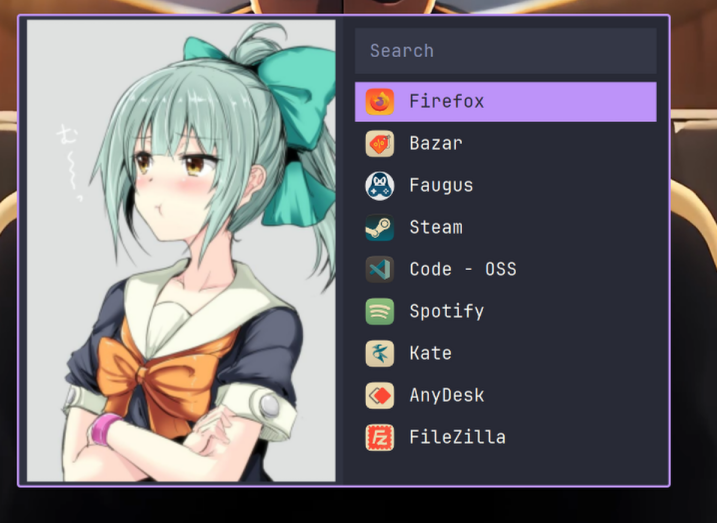

# LoboViejo79 Rofi Walker Style

Launcher de aplicaciones para Linux construido con **Rofi**, diseñado para llevar a **KDE Plasma 6 sobre Wayland** una experiencia visual inspirada en el launcher Walker mostrado por **Graplo**. Mantiene Rofi como motor, adopta una paleta Dracula e incorpora una columna de imagen vertical aleatoria, buscador, iconos de aplicaciones y un instalador automático para familias **Arch Linux, Debian/Ubuntu y Fedora**.



## Inspiración y créditos

Este proyecto nació a partir de la inspiración visual del contenido de **Graplo** en YouTube. En su configuración, Graplo utiliza **Walker** como lanzador y muestra una interfaz con imagen vertical, búsqueda y lista compacta de aplicaciones. La idea de **LoboViejo79 Rofi Walker Style** fue reinterpretar ese concepto y llevarlo a **Rofi**, con especial foco en usuarios de **KDE Plasma 6 + Wayland**.

- Canal de YouTube de Graplo: https://www.youtube.com/@Graplo
- Proyecto original de esta implementación en Rofi: **LoboViejo79**

> Este proyecto no es un fork de Walker ni está afiliado con Graplo. Es una implementación independiente en Rofi inspirada en la presentación visual mostrada en su contenido. Se agradece y reconoce expresamente a Graplo por la inspiración que dio origen a esta adaptación.

## Características

- Rofi en modo `drun` con iconos.
- Diseño compacto estilo Walker.
- Paleta Dracula.
- Imagen vertical aleatoria en cada apertura.
- Resolución recomendada para imágenes: **800×1200 px (2:3)**.
- JetBrainsMono Nerd Font instalada automáticamente si no está presente.
- Instalador multi-distro.
- Backup de archivos LoboViejo79 existentes antes de sobrescribirlos.
- Desinstalador conservador: no borra Rofi ni tus imágenes personales.
- Diseñado y afinado para **KDE Plasma 6 + Wayland**; también puede ejecutarse desde otros escritorios/compositores compatibles con Rofi.

## Instalación rápida

```bash
chmod +x install.sh
./install.sh
```

Después agregá imágenes a:

```text
~/.config/rofi/walker-images/
```

Probá el launcher:

```bash
~/.config/rofi/scripts/loboviejo79-launcher.sh
```

## Atajo en KDE Plasma 6

1. Preferencias del sistema → **Teclado → Atajos**.
2. **Añadir nuevo → Orden o guion**.
3. Comando:

```text
/home/TU_USUARIO/.config/rofi/scripts/loboviejo79-launcher.sh
```

4. Asignar, por ejemplo, **Meta + Espacio**.

> Se recomienda usar la ruta absoluta en el atajo de KDE en lugar de `~`.

## Estructura instalada

```text
~/.config/rofi/
├── themes/
│   └── loboviejo79-walker.rasi
├── scripts/
│   └── loboviejo79-launcher.sh
├── walker-images/
└── loboviejo79-backups/
```

Además se crea:

```text
~/.local/share/applications/loboviejo79-rofi.desktop
```

## Diagnóstico

```bash
./check.sh
```

## Desinstalación

```bash
./uninstall.sh
```

Para eliminar también la copia local de JetBrainsMono Nerd Font instalada por este proyecto:

```bash
./uninstall.sh --remove-font
```

El desinstalador **no elimina el paquete Rofi**, porque podría estar siendo utilizado por otras configuraciones del usuario.

## Distribuciones soportadas por el instalador

| Familia | Gestor | Paquete Rofi |
|---|---|---|
| Arch Linux / CachyOS / EndeavourOS / Manjaro y derivados | pacman | `rofi` |
| Debian / Ubuntu / Linux Mint y derivados | apt | `rofi` |
| Fedora y derivados con dnf | dnf | `rofi` |

El proyecto se desarrolló y ajustó visualmente con Rofi 2.x. En repositorios Debian estables pueden existir versiones 1.7.x; el instalador avisa si el resultado visual pudiera variar.

## Imágenes

El repositorio no necesita distribuir arte de terceros. Cada usuario puede copiar sus propias imágenes a `~/.config/rofi/walker-images/`. Para publicar este proyecto en GitHub, asegurate de tener permiso para redistribuir cualquier imagen que agregues.

## Documentación completa

Abrí:

```text
docs/manual.html
```

Incluye capturas, explicación de archivos, instalación, personalización y solución de problemas.

## Créditos y referencias

- **Graplo — YouTube:** https://www.youtube.com/@Graplo — inspiración visual original del concepto Walker que motivó esta adaptación a Rofi.
- **Walker:** referencia conceptual del launcher mostrado por Graplo.

## Fuentes técnicas

- Rofi: https://davatorium.github.io/rofi/
- Arch Linux package: https://archlinux.org/packages/extra/x86_64/rofi/
- Debian package: https://packages.debian.org/stable/x11/rofi
- Fedora package: https://packages.fedoraproject.org/pkgs/rofi/rofi
- Nerd Fonts: https://github.com/ryanoasis/nerd-fonts

## Licencia

Código del proyecto: MIT. Las capturas incluidas en `docs/assets/` documentan esta implementación en Rofi. Las imágenes o ilustraciones personales mostradas dentro del launcher no se distribuyen como colección de wallpapers y pueden pertenecer a sus respectivos autores. El crédito a Graplo corresponde a la inspiración visual y no implica afiliación ni cesión de derechos sobre su contenido.
